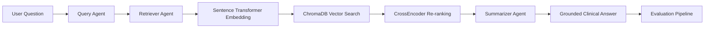

<p align="center">
  
</p>

<p align="center">
  <a href="YOUR_STREAMLIT_DEMO_URL"></a>
  <a href="https://github.com/uditnegi16/MedNotes-RAG"></a>
  <a href="#"></a>
  <a href="#"></a>
  <a href="#"></a>
  <a href="#"></a>
  <a href="#"></a>
</p>

<p align="center">
  
  
  
  
</p>

---

# MedNotes RAG — Clinical Document QA Assistant

Production-style Retrieval-Augmented Generation (RAG) system for answering questions over de-identified clinical documents using a **CrewAI multi-agent pipeline**, **HuggingFace embeddings**, **CrossEncoder reranking**, **ChromaDB vector search**, and an **evaluation framework** measuring retrieval quality and answer grounding.

Unlike a simple chatbot, MedNotes separates retrieval and answer generation into dedicated agents while validating system quality through automated evaluation before deployment.

---

# Overview

MedNotes RAG allows users to ask natural language medical questions over a corpus of de-identified clinical notes.

The system first retrieves the most relevant documents using semantic embeddings, reranks them with a CrossEncoder, and finally generates a grounded response using only retrieved evidence.

A CrewAI workflow orchestrates independent agents responsible for:

- Query optimization
- Clinical document retrieval
- Evidence-based summarization

An integrated evaluation pipeline measures retrieval quality, keyword coverage, answer grounding and overall system performance to support an SDLC-style workflow instead of relying only on manual testing.

---

# Demo

YOUR_GITHUB_VIDEO_URL_HERE

---

# Screenshots

<p align="center">
  
  
</p>

<p align="center">
  
  
</p>

---

# System Architecture

<p align="center">
  
</p>

---

# Multi-Agent Workflow



---

# Tech Stack

| Layer | Technology |
|--------|------------|
| Frontend | Streamlit |
| Agent Framework | CrewAI |
| Embeddings | HuggingFace Sentence Transformers |
| Vector Database | ChromaDB |
| Retrieval | Semantic Search |
| Re-ranking | CrossEncoder |
| LLM | HuggingFace Inference API |
| Evaluation | Custom Python Evaluation Suite |
| Dataset | MTSamples Clinical Notes |
| Logging | Python Logging |
| Language | Python 3.12 |

---

# Features

- CrewAI multi-agent orchestration
- Dedicated Query Agent
- Dedicated Retriever Agent
- Dedicated Summarizer Agent
- Semantic document retrieval
- HuggingFace embeddings
- ChromaDB vector database
- CrossEncoder reranking
- Clinical document question answering
- Source-grounded responses
- Streamlit interface
- Persistent chat history
- Automatic conversation titles
- Logging support
- Evaluation framework
- GitHub Actions CI
- Modular project structure

---

# Evaluation Pipeline

Unlike basic portfolio RAG projects, MedNotes includes an automated evaluation suite.

The evaluation measures:

- Retrieval Coverage
- Keyword Coverage
- Source Grounding
- Successful Retrieval Rate
- Overall Evaluation Score

The evaluation dataset consists of multiple manually designed clinical QA pairs covering different medical specialties.

---

# Sample Evaluation Results

| Metric | Result |
|---------|---------|
| Tests Executed | 35 |
| Retrieval Coverage | 83.33% |
| Source Grounding | 100% |
| Overall Evaluation | 63.97% |
| Failed Queries | Mostly due to HuggingFace monthly API credit exhaustion rather than retrieval failures |

> The grounding metric verifies that generated answers stay within retrieved clinical evidence instead of introducing unsupported medical facts.

---

# Project Structure

```text
MedNotes-RAG/

├── app.py
├── requirements.txt
├── README.md
│
├── src/
│   ├── agents/
│   ├── memory/
│   ├── tools/
│   ├── crew.py
│   ├── logger.py
│   └── config.py
│
├── data/
│   ├── documents/
│   └── vectorstore/
│
├── evaluations/
│   ├── evaluate_rag.py
│   ├── test_dataset.json
│   └── embedding_queries.json
│
├── .github/
│   └── workflows/
│       └── ci.yml
│
└── screenshots/
```

---

# Local Setup

## Clone Repository

```bash
git clone https://github.com/uditnegi16/MedNotes-RAG.git

cd MedNotes-RAG
```

## Create Virtual Environment

```powershell
python -m venv .venv

.venv\Scripts\activate
```

## Install Dependencies

```powershell
pip install -r requirements.txt
```

## Create `.env`

```env
HF_TOKEN=your_huggingface_token

LLM_MODEL=your_model_name
```

## Build Vector Database

```powershell
python ingest.py
```

## Run Streamlit

```powershell
streamlit run app.py
```

Open

```
http://localhost:8501
```

---

# Running Evaluation

```powershell
python evaluations/evaluate_rag.py
```

The evaluation automatically:

- Runs every question
- Retrieves evidence
- Generates answers
- Calculates keyword coverage
- Performs source-grounding checks
- Produces a final evaluation report

---

# Continuous Integration

GitHub Actions automatically executes on every push:

- Dependency installation
- Import validation
- Evaluation script execution
- Build verification
- Basic regression testing

---
